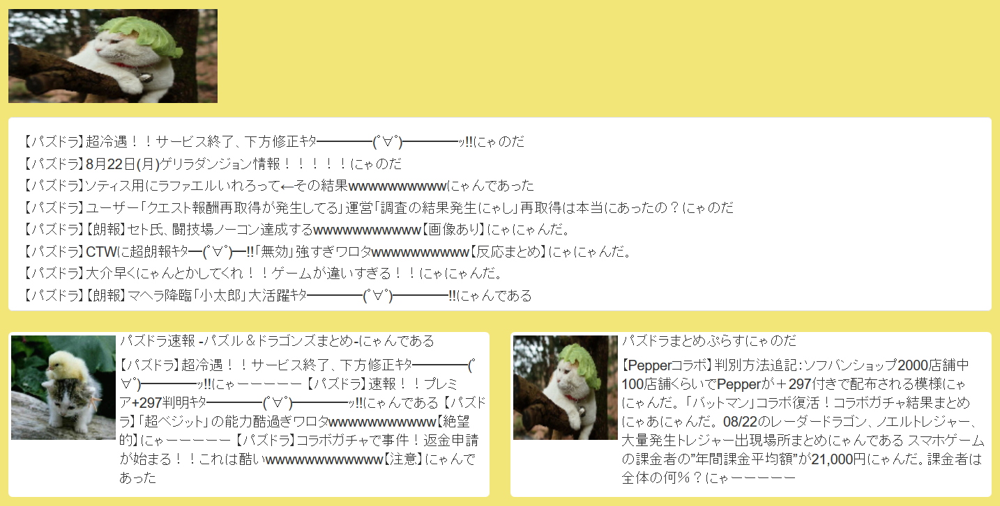

# cat_server.py
## Cat Proxy Server
Cat proxy server for your cat needs. Run this script in a Terminal to create a cat server that automatically replaces all images on a webpage to pictures of cats and catify the endings of Japanese sentences.

